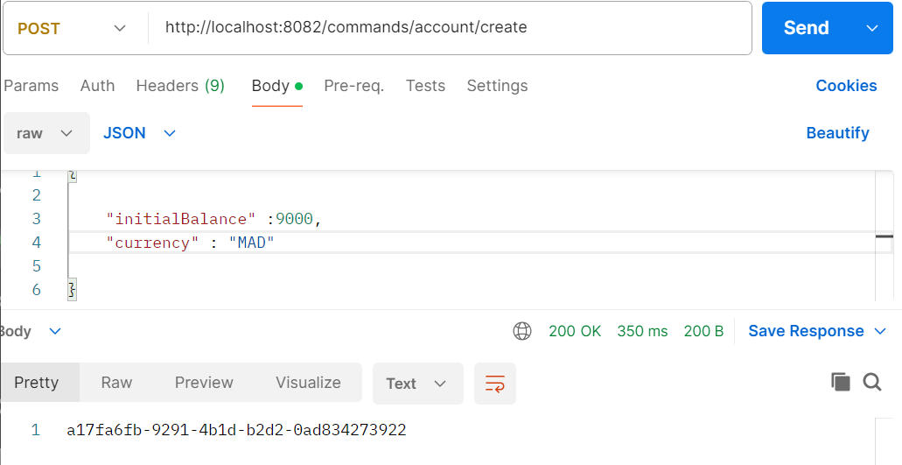
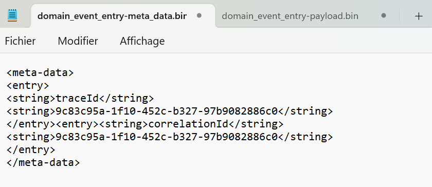
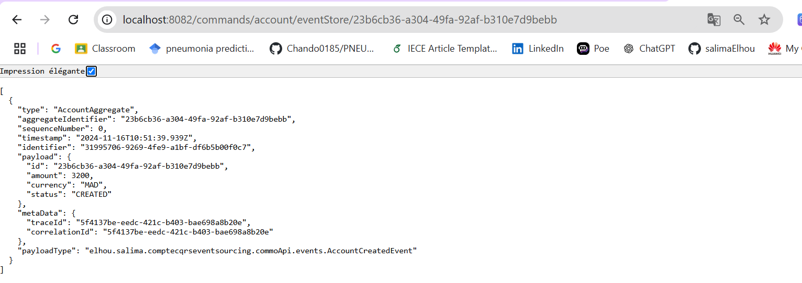
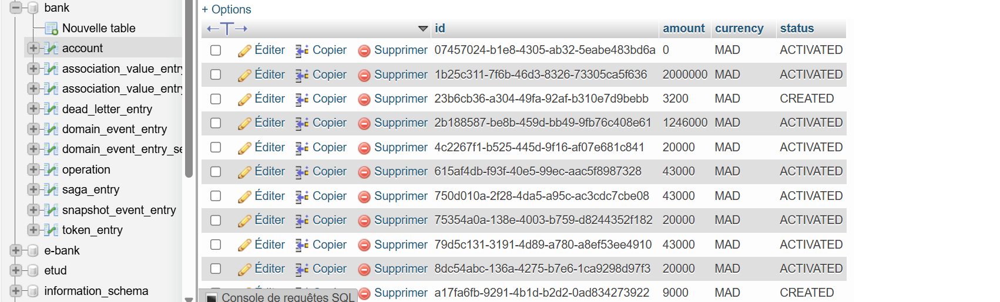

# Gestion de Comptes avec CQRS et Event Sourcing

Cette application propose une gestion avancée de comptes bancaires en adoptant les patterns **Command Query Responsibility Segregation (CQRS)** et **Event Sourcing**. Le projet est conçu avec **Spring Boot** et **Axon Framework**.

---

## Description
Ce projet met en œuvre les concepts de CQRS et d’Event Sourcing pour assurer une gestion efficace des comptes. Il permet de :
- Exécuter des commandes telles que la création, le débit ou le crédit des comptes.
- Obtenir l’état actuel des comptes en rejouant les événements stockés.

---

## Technologies utilisées
- **Java**
- **Spring Boot**
- **Axon Framework**
- **Event Store**
- **MySQL** pour les phases de développement et de test

---

## Structure du projet
Le projet est structuré pour séparer clairement les responsabilités entre les commandes et les requêtes :
- **Commandes** : Gestion des actions comme la création de compte, le débit, le crédit ou la fermeture.
- **Événements** : Enregistrement des changements d’état sous forme d’événements, tels que `AccountCreatedEvent` et `AccountDebitedEvent`.

---

## Part 1 : Gestion des Commandes (UI - CQRS)

- L'interface utilisateur (UI) envoie des commandes pour effectuer des actions sur les comptes, telles que la création d’un compte ou la gestion des transactions financières.
- Ces commandes sont traitées par le côté Command de l'architecture CQRS, qui enregistre les modifications sous forme d’événements dans l’Event Store.

### Illustrations :
- Interface des commandes :  
  
- Base de données :  
  

#### Événements enregistrés :
- **Meta Data** :  
  
- **Payload** :  
 

Dans un système basé sur **Event Sourcing**, chaque événement correspond à un changement d’état, ce qui permet une traçabilité complète. Par exemple :
1. Lorsqu’un compte est créé, un événement `AccountCreatedEvent` est généré avec des détails comme le montant initial, la devise, et le statut `CREATED`.
2. Des événements tels que `AccountActivatedEvent` mettent à jour le statut à `ACTIVATED` après validation.

### Captures supplémentaires :
- Commande de création :  
- Base de données après création :  
  

---

## Part 2 : Requêtes et Affichage des Données (UI - Query)

- Le côté Query gère les requêtes pour afficher les informations à jour des comptes, grâce aux projections générées à partir des événements enregistrés.

### Fonctionnalités :
- **Affichage de tous les comptes** :  
  
- **Recherche par ID** :  
  

---

Ce projet illustre la puissance de **CQRS** et **Event Sourcing** pour garantir une gestion performante et traçable des comptes bancaires.  
